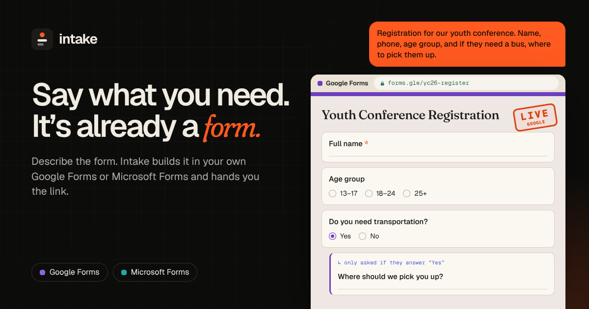

# Intake

> **Describe what you need to collect. Intake builds the form.**

Intake is an agent-powered form creation platform that turns natural-language descriptions into fully structured, usable forms.

Instead of opening a form builder, choosing question types, configuring validation, creating sections, setting required fields, and manually wiring conditional logic, users simply describe what they want to collect.

Intake interprets that description, produces a structured form specification, validates the specification, and creates the actual form.

The goal is not to build another form builder.

The goal is to make **form creation an intent problem instead of a configuration problem.**

<p align="center">
  
</p>

<p align="center">
  <sub>Connect your Google or Microsoft account, describe the form, and get a real form in your own account with a share link. &nbsp;·&nbsp; <a href="#landing-page">Run the landing page</a></sub>
</p>

---

## Current implementation (PR 03: provider connections)

The landing page and an authenticated workspace live in `apps/landing`. Intake is **not** a form builder: the landing playground is a demo only, and no real forms are created.

Two authorization concepts stay separate:

- **Intake login** — Better Auth email/password sessions on Neon PostgreSQL. This answers who the user is.
- **Provider connection** — an explicit OAuth grant for Google or Microsoft, stored apart from Better Auth's `account` table. Signing in does not authorize Forms access.

An authenticated user can open Connections, start Google or Microsoft OAuth (authorization code + PKCE), and see connected, expired, failed, cancelled, or not-configured states. Grants are encrypted at rest and scoped to that Intake user. Disconnect removes the Intake copy. Google revocation is attempted; Microsoft does not offer a supported per-app revoke, and the UI says so.

Form creation is not implemented. Microsoft still has no supported Forms create/edit API, so a Microsoft connection does not claim that it can create forms. If OAuth client credentials are missing, Connections shows setup required and does not fake a grant.

**Setup required:** No Neon credentials and no Google Cloud or Microsoft Entra app registration are present in this repository or cloud environment. See [Local Development](#local-development) and [apps/landing/server/providers/README.md](apps/landing/server/providers/README.md). Authenticated and OAuth flows cannot be end-to-end verified until those external consoles are configured.

---

## Table of Contents

* [Overview](#overview)
* [The Problem](#the-problem)
* [Why Form Builders Still Feel Complicated](#why-form-builders-still-feel-complicated)
* [The Core Idea](#the-core-idea)
* [The Intake Thesis](#the-intake-thesis)
* [What Intake Does](#what-intake-does)
* [Example](#example)
* [How It Works](#how-it-works)
* [Product Workflow](#product-workflow)
* [Natural Language → Form Specification](#natural-language--form-specification)
* [The Form Specification](#the-form-specification)
* [Agent Architecture](#agent-architecture)
* [Validation](#validation)
* [Form Generation](#form-generation)
* [Editing Existing Forms](#editing-existing-forms)
* [Conversation State](#conversation-state)
* [Supported Form Capabilities](#supported-form-capabilities)
* [Conditional Logic](#conditional-logic)
* [Authentication & Authorization](#authentication--authorization)
* [Google Integration](#google-integration)
* [Security](#security)
* [Privacy](#privacy)
* [Reliability](#reliability)
* [Architecture](#architecture)
* [Data Model](#data-model)
* [Technology Stack](#technology-stack)
* [Project Structure](#project-structure)
* [API Design](#api-design)
* [Agent Design](#agent-design)
* [Error Handling](#error-handling)
* [Observability](#observability)
* [Testing Strategy](#testing-strategy)
* [Landing Page](#landing-page)
* [Local Development](#local-development)
* [Environment Variables](#environment-variables)
* [Deployment](#deployment)
* [Design Principles](#design-principles)
* [What Intake Is Not](#what-intake-is-not)
* [Current Limitations](#current-limitations)
* [Roadmap](#roadmap)
* [Engineering Challenges](#engineering-challenges)
* [Why This Project Exists](#why-this-project-exists)
* [Contributing](#contributing)
* [License](#license)

---

# Overview

Creating a form is usually treated as a simple task.

The underlying process is not.

A user who wants to collect information from people has to make a series of decisions:

* What questions should I ask?
* Which question type should I use?
* Which questions should be required?
* Should this be a short answer, paragraph, dropdown, checkbox, or multiple choice?
* Should users be allowed to select multiple answers?
* Do I need validation?
* Should certain questions only appear based on previous answers?
* Should the form be split into sections?
* What should the form description say?
* What happens after submission?
* How do I share it?

For someone who already understands form builders, these are normal configuration steps.

For everyone else, they are unnecessary cognitive overhead.

Intake changes the interaction model.

Instead of:

```text
Open builder
    ↓
Create form
    ↓
Add question
    ↓
Choose type
    ↓
Configure question
    ↓
Repeat
    ↓
Configure logic
    ↓
Review
    ↓
Publish
```

Intake aims for:

```text
Describe what you need
        ↓
Intake understands the intent
        ↓
Structured form specification
        ↓
Validation
        ↓
Form creation
        ↓
Live form
        ↓
Share
```

---

# The Problem

## Form builders are configuration-first

Traditional form builders expose the internal structure of a form directly to the user.

The user has to understand the tool before they can accomplish the task.

For example, someone might say:

> "I need a registration form for our youth conference. Ask for their name, phone number, age group, church, whether they need transportation, and if they need transportation ask where they want to be picked up."

The actual requirement is extremely easy to understand.

But translating it into a form requires several manual operations.

The user must create:

1. A name field.
2. A phone number field.
3. An age-group selection.
4. A church field.
5. A transportation question.
6. A conditional follow-up question.
7. A pickup-location field.
8. Required/optional configuration.
9. Potential validation.
10. Appropriate descriptions.

The user understands **what they want**.

The form builder requires them to understand **how the builder represents what they want**.

That gap is the problem Intake explores.

---

# Why Form Builders Still Feel Complicated

The problem isn't that existing form builders are badly designed.

Tools such as Google Forms and other form platforms have spent years refining their interfaces.

The problem is more fundamental.

The user is often not thinking in terms of:

> "I need a multiple-choice question with three options."

They're thinking:

> "I need to know whether the person is coming by bus."

The interface forces the user to translate their intent into implementation details.

That translation is where friction appears.

Intake attempts to remove that translation step.

---

# The Core Idea

Intake introduces a natural-language layer between the person creating the form and the form-building system.

The user describes the information they need.

Intake converts that description into a structured representation.

For example:

```text
Create a volunteer registration form.

Ask for:
- full name
- email
- phone number
- age
- area of interest

Ask whether they have volunteered before.

If they answer yes, ask where.

If they select media as their area of interest,
ask what kind of media work they have experience with.

Make name, email, phone number and area of interest required.
```

Intake converts this into a form specification.

Conceptually:

```text
User Intent
     ↓
Natural Language Understanding
     ↓
Form Planning
     ↓
Structured Form Specification
     ↓
Validation
     ↓
Provider Adapter
     ↓
Actual Form
```

The user never has to manually construct the underlying representation.

---

# The Intake Thesis

> **If people can describe the information they need to collect, they should not have to manually construct the interface used to collect it.**

This is the fundamental idea behind Intake.

The project is an exploration of what happens when a traditional configuration interface is replaced with an intent-driven interface.

The form builder becomes the execution layer.

Natural language becomes the authoring layer.

---

# What Intake Does

At its core, Intake provides five capabilities:

### 1. Understand

Interpret a user's description of the information they want to collect.

### 2. Plan

Determine the questions, types, options, requirements, validation rules, sections, and conditional relationships necessary to satisfy the request.

### 3. Validate

Ensure that the generated form is structurally valid and that the generated instructions do not produce an invalid or contradictory form.

### 4. Create

Translate the validated specification into an actual form through a supported form provider.

### 5. Modify

Allow the user to continue communicating with Intake to modify the form.

For example:

> "Make email optional."

or:

> "Add a question asking how they heard about the event."

or:

> "If they select Other, ask them to explain."

Intake interprets the change and applies it to the existing form.

---

# Example

## User

> Create a registration form for a football tournament.

> I need the player's full name, phone number, age, gender, team name and position.

> Ask whether they have played professionally before.

> If yes, ask which club.

> Make everything required except the professional experience question.

---

## Intake

The system produces an internal specification similar to:

```json
{
  "title": "Football Tournament Registration",
  "description": "Register for the upcoming football tournament.",
  "questions": [
    {
      "id": "full_name",
      "type": "short_text",
      "label": "Full name",
      "required": true
    },
    {
      "id": "phone",
      "type": "phone",
      "label": "Phone number",
      "required": true
    },
    {
      "id": "age",
      "type": "number",
      "label": "Age",
      "required": true
    },
    {
      "id": "gender",
      "type": "single_choice",
      "label": "Gender",
      "required": true,
      "options": [
        "Male",
        "Female"
      ]
    },
    {
      "id": "team",
      "type": "short_text",
      "label": "Team name",
      "required": true
    },
    {
      "id": "position",
      "type": "single_choice",
      "label": "Playing position",
      "required": true
    },
    {
      "id": "professional",
      "type": "single_choice",
      "label": "Have you played professionally before?",
      "required": false,
      "options": [
        "Yes",
        "No"
      ]
    },
    {
      "id": "club",
      "type": "short_text",
      "label": "Which club did you play for?",
      "required": true,
      "visibility": {
        "when": {
          "question": "professional",
          "equals": "Yes"
        }
      }
    }
  ]
}
```

The JSON above is not the user's interface.

It is an intermediate representation used by Intake.

The system then translates that representation into the target form provider.

---

# How It Works

The system can be understood as several layers.

```text
┌──────────────────────────────┐
│            User              │
│                              │
│  "Create a registration..."  │
└──────────────┬───────────────┘
               │
               ▼
┌──────────────────────────────┐
│       Conversation Layer     │
│                              │
│ Context + clarification      │
└──────────────┬───────────────┘
               │
               ▼
┌──────────────────────────────┐
│        Form Planner          │
│                              │
│ Intent → Form specification  │
└──────────────┬───────────────┘
               │
               ▼
┌──────────────────────────────┐
│       Schema Validator       │
│                              │
│ Structural + semantic checks │
└──────────────┬───────────────┘
               │
               ▼
┌──────────────────────────────┐
│       Provider Adapter       │
│                              │
│ Google Forms / other target  │
└──────────────┬───────────────┘
               │
               ▼
┌──────────────────────────────┐
│          Live Form           │
│                              │
│        Shareable URL         │
└──────────────────────────────┘
```

The important architectural decision is that the language model should **not directly control the external form provider**.

Instead:

```text
LLM
 ↓
Typed specification
 ↓
Validation
 ↓
Deterministic provider operations
```

This creates a boundary between probabilistic reasoning and deterministic execution.

---

# Product Workflow

## Step 1 — Describe

The user starts with a natural-language request.

Example:

> "I need a customer feedback form for a restaurant."

They can provide as much or as little detail as they want.

---

## Step 2 — Interpret

Intake extracts:

* form purpose
* intended audience
* required information
* optional information
* question relationships
* possible validation requirements
* sections
* conditional logic
* wording requirements

---

## Step 3 — Clarify

Intake should not ask unnecessary questions.

If the request is sufficiently clear, it should proceed.

If something genuinely affects the resulting form, Intake may ask.

Example:

> "What age groups should the form provide?"

This is preferable to making an arbitrary assumption.

The goal is **minimal clarification**, not a long interview.

---

## Step 4 — Preview

Before creating the external form, Intake can present the generated structure.

Example:

```text
Customer Feedback

1. Name
   Short answer · Optional

2. How was your experience?
   Multiple choice · Required

   ○ Excellent
   ○ Good
   ○ Average
   ○ Poor

3. What could we improve?
   Paragraph · Optional
```

The user can then request changes.

---

## Step 5 — Create

Once approved, Intake sends the validated specification to the form provider.

The provider creates the actual form.

---

## Step 6 — Return

Intake returns the relevant links.

For example:

```text
Your form is ready.

View form
Edit form

https://...
```

The resulting form is not a mockup.

It is a real, usable form.

---

# Natural Language → Form Specification

The most important boundary in Intake is the conversion from natural language into a deterministic specification.

The model should not be trusted to directly execute arbitrary external operations.

Instead, it produces a structured representation.

For example:

```text
Natural language
        ↓
Intent extraction
        ↓
Form specification
        ↓
Schema validation
        ↓
Execution
```

This makes the system easier to:

* test
* debug
* version
* validate
* extend
* reproduce
* audit

It also allows the model to be replaced without rewriting the provider layer.

---

# The Form Specification

The internal specification is the central contract between the reasoning layer and the execution layer.

A simplified schema might contain:

```typescript
type FormSpecification = {
  title: string;
  description?: string;
  sections: Section[];
  settings: FormSettings;
};

type Section = {
  id: string;
  title?: string;
  description?: string;
  questions: Question[];
};

type Question = {
  id: string;
  type: QuestionType;
  label: string;
  description?: string;
  required: boolean;
  options?: Option[];
  validation?: ValidationRule[];
  visibility?: VisibilityRule;
};
```

Possible question types include:

```text
short_text
long_text
email
phone
number
single_choice
multiple_choice
dropdown
date
time
file
rating
```

The actual supported types depend on the capabilities of the target provider.

---

# Agent Architecture

Intake should not be implemented as one giant prompt.

The agent should have distinct responsibilities.

## Intent Parser

Extracts the user's requirements.

```text
User message
    ↓
Intent parser
    ↓
Requirements
```

---

## Form Planner

Transforms requirements into a proposed form structure.

```text
Requirements
    ↓
Form planner
    ↓
FormSpecification
```

---

## Validator

Checks whether the specification is valid.

```text
FormSpecification
    ↓
Validator
    ↓
Valid / Invalid
```

---

## Provider Executor

Turns the specification into provider API operations.

```text
Validated specification
    ↓
Provider adapter
    ↓
External form
```

---

## Conversation Manager

Maintains the context required for modifications.

For example:

```text
User:
Create a registration form.

Intake:
...

User:
Add a question asking for their state.

Intake:
...

User:
Make it optional.

Intake:
...
```

The final instruction depends on the previous form state.

---

# Validation

Validation is critical because language models can produce structurally incorrect output.

Intake therefore validates the generated specification before execution.

Validation occurs at multiple levels.

## Structural Validation

Checks:

* required properties
* supported question types
* valid IDs
* valid option structures
* valid sections
* valid visibility rules

---

## Semantic Validation

Checks for issues such as:

```text
Question A:
Have you attended before?

Question B:
Which previous event did you attend?
```

If Question B is visible only when Question A = "No", the system should flag the contradiction.

---

## Provider Validation

A form specification can be valid internally but unsupported by the target provider.

For example:

```text
Internal capability
        ↓
Provider capability check
        ↓
Supported / unsupported
```

Unsupported capabilities should produce explicit errors instead of silently degrading the form.

---

# Form Generation

The provider layer is responsible for creating the actual form.

A provider adapter might expose operations such as:

```typescript
interface FormProvider {
  createForm(input: FormSpecification): Promise<CreatedForm>;

  updateForm(
    formId: string,
    operations: FormOperation[]
  ): Promise<UpdatedForm>;

  deleteForm(
    formId: string
  ): Promise<void>;

  getForm(
    formId: string
  ): Promise<FormState>;
}
```

The agent should never need to know provider-specific implementation details.

That separation makes additional providers possible later.

---

# Editing Existing Forms

Creating the initial form is only half of the product.

The more interesting interaction begins after creation.

Users should be able to say:

> "Add a phone number field."

or:

> "Move age before email."

or:

> "Make the address question optional."

or:

> "Add an 'Other' option."

or:

> "If they select Other, ask them to explain."

The system converts each instruction into a set of deterministic operations.

For example:

```text
User request

"Make email optional."
        ↓
Interpretation
        ↓
Update question.email.required = false
        ↓
Validation
        ↓
Provider operation
        ↓
External form updated
```

---

# Conversation State

Conversation state should be separated from the form itself.

A conversation may contain:

```text
Conversation
 ├── messages
 ├── current form reference
 ├── user preferences
 └── generated operations
```

The form contains:

```text
Form
 ├── specification
 ├── provider ID
 ├── provider URL
 ├── version
 └── metadata
```

This distinction allows a form to exist independently of a particular conversation.

---

# Supported Form Capabilities

The initial implementation focuses on capabilities that provide the most useful coverage without attempting to reproduce every feature of a mature form platform.

## Questions

* Short text
* Long text
* Email
* Phone
* Number
* Single choice
* Multiple choice
* Dropdown
* Date
* Time
* Rating

## Configuration

* Required/optional
* Descriptions
* Options
* Validation
* Sections
* Question ordering

## Logic

* Conditional questions
* Conditional sections
* Dependent questions
* Branching

## Form metadata

* Title
* Description
* Confirmation message

---

# Conditional Logic

Conditional logic is one of the areas where natural language becomes particularly useful.

A user can say:

> "Ask if they need accommodation. If they say yes, ask what type of accommodation they need."

Intake translates this into a relationship:

```text
need_accommodation
        │
        ├── Yes ──→ accommodation_type
        │
        └── No
```

The user does not need to understand branching rules.

They simply describe the desired behavior.

---

# Authentication & Authorization

Intake requires users to have an identity within the application.

Authentication may support:

* Email/password
* OAuth
* Session-based authentication

Authorization must ensure that users can only access forms belonging to them.

At minimum:

```text
User A
 ├── Form A
 └── Form B

User B
 └── Form C
```

User A must never be able to retrieve or modify Form C.

Authorization should be enforced server-side.

---

# Google Integration

Google Forms is the initial provider target.

The integration is responsible for securely connecting a user's Google account to Intake and creating or modifying forms on their behalf.

The provider integration should be isolated from the rest of the application.

Conceptually:

```text
Intake
   │
   ▼
Provider Interface
   │
   ▼
Google Forms Adapter
   │
   ▼
Google
```

This prevents Google-specific implementation details from leaking into the core agent architecture.

The OAuth connection half of that boundary is implemented. Form creation is not. See [apps/landing/server/providers/README.md](apps/landing/server/providers/README.md) for scopes, redirect URIs, and the verified Google and Microsoft API limits.

---

# Security

Intake handles user accounts, provider credentials, form metadata, and potentially sensitive form content.

Security therefore cannot be treated as a final feature.

## OAuth credentials

Provider access tokens should:

* never be exposed to the browser unnecessarily
* never be included in client-side logs
* be stored securely
* be encrypted where appropriate
* be refreshed through the provider's supported mechanism

---

## Authorization

Every form operation should verify ownership.

For example:

```text
PATCH /forms/:id
```

must not simply trust the provided form ID.

The server must establish:

```text
authenticated user
        ↓
owns form
        ↓
allowed operation
```

---

## Prompt injection

Because users control natural-language input, Intake must assume that arbitrary text may attempt to manipulate the agent.

External content should not automatically become trusted instructions.

The system should maintain a strict distinction between:

```text
System instructions
Application rules
User intent
External content
```

---

## Provider operations

The model should never receive unrestricted access to arbitrary APIs.

Instead, tools should expose constrained operations.

For example:

```text
create_form
add_question
update_question
delete_question
move_question
publish_form
```

rather than:

```text
execute_arbitrary_request
```

This significantly reduces the blast radius of model errors.

---

# Privacy

A form may contain information about:

* customers
* students
* employees
* event participants
* applicants
* clients

Intake should therefore minimize the information it stores.

The application should distinguish between:

### Form configuration

The structure of the form.

### Form responses

The information submitted by respondents.

The initial product should avoid unnecessarily storing respondent data if the underlying provider already handles response storage.

---

# Reliability

A natural-language system can fail in ways traditional CRUD applications usually do not.

For example:

```text
User request
    ↓
Model interpretation
    ↓
Valid specification
    ↓
Provider API failure
```

or:

```text
User request
    ↓
Incorrect interpretation
    ↓
Valid but unwanted specification
```

Intake therefore needs explicit states.

Example:

```text
draft
planning
awaiting_confirmation
creating
created
updating
failed
```

This allows the UI to communicate what is actually happening.

---

# Architecture

A high-level architecture:

```text
                         ┌───────────────┐
                         │     User      │
                         └───────┬───────┘
                                 │
                                 ▼
                     ┌─────────────────────┐
                     │    Web Application  │
                     └──────────┬──────────┘
                                │
                                ▼
                     ┌─────────────────────┐
                     │    API / Backend    │
                     └──────────┬──────────┘
                                │
                 ┌──────────────┼──────────────┐
                 │              │              │
                 ▼              ▼              ▼
          ┌───────────┐  ┌────────────┐  ┌─────────────┐
          │ Database  │  │ Agent Layer│  │ Auth Layer  │
          └───────────┘  └─────┬──────┘  └─────────────┘
                                │
                                ▼
                        ┌──────────────┐
                        │ Form Schema  │
                        └──────┬───────┘
                               │
                               ▼
                        ┌──────────────┐
                        │  Validator   │
                        └──────┬───────┘
                               │
                               ▼
                       ┌─────────────────┐
                       │ Provider Layer  │
                       └────────┬────────┘
                                │
                                ▼
                         ┌────────────┐
                         │   Google   │
                         │   Forms    │
                         └────────────┘
```

---

# Data Model

A simplified relational model could look like:

```text
users
  ├── id
  ├── email
  ├── name
  └── created_at

provider_accounts
  ├── id
  ├── user_id
  ├── provider
  ├── provider_account_id
  ├── access_token
  ├── refresh_token
  └── expires_at

forms
  ├── id
  ├── user_id
  ├── provider
  ├── provider_form_id
  ├── title
  ├── specification
  ├── status
  ├── version
  ├── created_at
  └── updated_at

conversations
  ├── id
  ├── user_id
  ├── form_id
  └── created_at

messages
  ├── id
  ├── conversation_id
  ├── role
  ├── content
  └── created_at

operations
  ├── id
  ├── form_id
  ├── conversation_id
  ├── operation
  ├── payload
  ├── status
  └── created_at
```

The exact schema may evolve during implementation.

The important principle is that the internal form specification remains versionable.

---

# Technology Stack

The exact stack can evolve, but the project is designed around a clear separation of concerns.

## Frontend

Potential responsibilities:

* authentication
* conversation interface
* form preview
* form history
* provider connection
* settings
* error states

---

## Backend

Responsible for:

* authentication
* authorization
* conversations
* agent orchestration
* form specifications
* provider integrations
* database access
* security-sensitive operations

---

## Database

Stores:

* users
* forms
* conversations
* messages
* provider connections
* operation history
* form versions

---

## AI layer

The AI layer is responsible for interpretation and planning.

It is **not** the source of truth.

The validated form specification is.

---

# Project Structure

A possible repository structure:

```text
intake/
├── apps/
│   ├── web/
│   │   ├── app/
│   │   ├── components/
│   │   ├── features/
│   │   └── lib/
│   │
│   └── api/
│       ├── routes/
│       ├── services/
│       ├── middleware/
│       └── lib/
│
├── packages/
│   ├── schema/
│   │   ├── form.ts
│   │   ├── question.ts
│   │   └── validation.ts
│   │
│   ├── agent/
│   │   ├── planner/
│   │   ├── parser/
│   │   ├── prompts/
│   │   └── tools/
│   │
│   ├── providers/
│   │   ├── core/
│   │   └── google/
│   │
│   └── database/
│
├── tests/
│   ├── agent/
│   ├── schema/
│   ├── providers/
│   └── integration/
│
├── docs/
│   ├── architecture/
│   ├── decisions/
│   └── provider/
│
├── .env.example
├── docker-compose.yml
├── package.json
└── README.md
```

The exact structure should follow the chosen stack.

---

# API Design

The API should expose application-level concepts rather than exposing provider internals.

Example endpoints:

```http
POST /api/conversations
GET  /api/conversations/:id
POST /api/conversations/:id/messages
```

Form endpoints:

```http
GET    /api/forms
POST   /api/forms
GET    /api/forms/:id
PATCH  /api/forms/:id
DELETE /api/forms/:id
```

Provider endpoints:

```http
GET  /api/providers
POST /api/providers/google/connect
POST /api/providers/google/callback
DELETE /api/providers/google/disconnect
```

The exact endpoint structure may change.

The principle is:

> The API represents Intake's domain model, not Google's API model.

---

# Agent Design

The agent should operate within a controlled environment.

A simplified execution loop:

```text
1. Receive user message
2. Load relevant conversation state
3. Load current form specification
4. Interpret request
5. Produce structured intent
6. Generate proposed changes
7. Validate changes
8. Request clarification if required
9. Confirm if necessary
10. Execute provider operations
11. Update internal state
12. Return result
```

This is deliberately different from:

```text
User
 ↓
LLM
 ↓
"Do whatever you want"
```

The latter is difficult to reason about and difficult to secure.

---

# Error Handling

Errors should be explicit.

Possible categories:

### User errors

```text
The request is ambiguous.
```

### Validation errors

```text
The generated form contains an invalid branching rule.
```

### Provider errors

```text
Google rejected the requested operation.
```

### Authentication errors

```text
The Google connection has expired.
```

### Internal errors

```text
The form could not be created due to an unexpected server error.
```

The user should receive useful information without exposing internal implementation details.

---

# Observability

Because Intake combines AI reasoning with external APIs, observability is important.

The system should track:

* request IDs
* conversation IDs
* form IDs
* provider operation IDs
* operation status
* latency
* provider errors
* validation failures
* agent failures

Sensitive information should not be written into logs unnecessarily.

---

# Testing Strategy

Testing Intake requires more than testing HTTP endpoints.

## Unit Tests

Test:

* schema validation
* question transformations
* visibility rules
* provider mappings
* authorization helpers
* operation generation

---

## Agent Tests

Use fixed natural-language examples.

Example:

```text
Create a contact form with name,
email and message.
```

Expected:

```text
name → short_text
email → email
message → long_text
```

The test should validate the resulting structured representation rather than relying on exact wording from the model.

---

## Scenario Tests

Example:

```text
Create registration form.
Add transport question.
If yes, ask pickup location.
Make phone required.
```

The entire workflow should be tested as a scenario.

---

## Integration Tests

Test the boundary between:

```text
validated specification
        ↓
provider adapter
        ↓
external API
```

Where possible, provider calls should be mocked for deterministic tests, with a smaller set of real integration tests.

---

# Landing Page

The marketing site lives in [`apps/landing`](apps/landing). It's built with Vite, React, TypeScript and [Motion](https://motion.dev). The "videos" on it are the real UI running on a scripted timeline, so you can pause, scrub and replay them. Phones get their own lighter layout with tap-through demo stories.

```bash
cd apps/landing
npm install
npm run dev        # http://localhost:5173
npm run build      # type-check + production build to dist/
```

**Deploying (Vercel / Netlify):** set the root directory to `apps/landing`, the build command to `npm run build` and the output folder to `dist`.

**Environment** (see [`apps/landing/.env.example`](apps/landing/.env.example)):

| Variable | What it does |
| --- | --- |
| `VITE_SITE_URL` | Absolute site URL for canonical and link-preview tags. Picked up automatically on Vercel and Netlify. |
| `VITE_WAITLIST_URL` | Where the "Get early access" box posts to. A Google Form's `…/formResponse` URL works, as do Formspree-style endpoints. |
| `VITE_WAITLIST_FIELD` | The field name for the email, e.g. `entry.123456789` for a Google Form, or `email`. |

---

# Local Development

The code in `apps/landing` now runs as two separate applications: Vite/React on Vercel and Express/Better Auth on Render. Use Node 22.12+ and npm.

1. In `apps/landing`, run `npm ci` and copy `.env.example` to `.env`.
2. Set a TLS Neon `DATABASE_URL` (`sslmode=require`), a random `BETTER_AUTH_SECRET` of at least 32 characters (`openssl rand -base64 32`), and `BETTER_AUTH_URL=http://localhost:5173` with no path or trailing slash. Never commit `.env`.
3. Run `npm run db:migrate` (Better Auth core tables), then `npm run db:migrate:intake` (provider-connection tables) against your intended database. `npm run db:generate` produces `db/auth.sql` for review only and does not include provider tables. No migration was performed by this PR.
4. Provider OAuth is optional until you want to connect Google or Microsoft. Leave those variables blank to get an honest "not configured" state. Real client ids and secrets come from Google Cloud and Microsoft Entra, not from this repository. Redirect URIs and scopes are documented in [apps/landing/server/providers/README.md](apps/landing/server/providers/README.md).
5. In separate terminals run `npm run dev:api` (Express, port 3001) and `npm run dev` (Vite, port 5173). Open Vite, not Express. Vite proxies `/api/*` to `API_PROXY_TARGET`, default `http://127.0.0.1:3001`.
6. For cloud previews, set `BETTER_AUTH_URL` to the exact HTTPS frontend preview origin, and register that same origin's provider callback URLs in Google Cloud and Entra if you intend to complete OAuth there.
7. Run `npm run typecheck`, `npm test`, and `npm run build`. `npm run preview` serves the frontend build with the local API proxy; `npm start` runs only the production API.

The browser uses same-origin `/api/auth/*` for Better Auth, `/api/me` for account state, and `/api/providers` for provider connections; grants never return tokens to the browser. Frontend documents are static; the shared client guard checks `/api/me` before rendering `/app`, `/app/connections`, and `/app/account`, and every API operation fails closed independently. Session cookies are managed by Better Auth (HTTP-only, secure on HTTPS). If the database is unavailable, API routes return 503 instead of exposing content or treating a failure as sign-out.

**Boundary for the next stage:** `getProviderConnection(userId, provider)` in `apps/landing/server/providers/service.ts` is the server-side way to ask whether a user has a usable provider grant and, if so, to receive an access token. The next PR can build Google Forms operations on that helper. It must not treat a Better Auth `account` row as permission, must not fake Microsoft Forms API calls, and must publish API-created Google Forms (`setPublishSettings`) because forms created after 30 June 2026 are unpublished by default.

---

# Environment Variables

See [`apps/landing/.env.example`](apps/landing/.env.example). Only `VITE_` variables are public browser configuration. Database credentials, auth secrets, provider encryption keys and OAuth secrets must never use that prefix.

- Render (server secrets): `DATABASE_URL`, `BETTER_AUTH_SECRET`, `BETTER_AUTH_URL` (public Vercel origin). Provider connection, only when you have real console credentials: `GOOGLE_OAUTH_CLIENT_ID`, `GOOGLE_OAUTH_CLIENT_SECRET`, `MICROSOFT_OAUTH_CLIENT_ID`, `MICROSOFT_OAUTH_CLIENT_SECRET`, optional `MICROSOFT_OAUTH_TENANT`, optional `PROVIDER_TOKEN_KEY`. Render supplies `PORT`. Blank provider variables are a setup state, not a successful connection. A changed domain requires updating `BETTER_AUTH_URL`, the provider redirect URIs in the provider consoles, and restarting the server.
- Vercel: `BACKEND_URL` (actual HTTPS Render origin, routing only); optional `VITE_SITE_URL` and existing public waitlist settings.
- Local: optional `API_PROXY_TARGET` changes Vite's backend target without changing browser URLs.

- Render: `DATABASE_URL`, `BETTER_AUTH_SECRET`, `BETTER_AUTH_URL` (public Vercel origin). Render supplies `PORT`.
- Vercel: `BACKEND_URL` (actual HTTPS Render origin, routing only); optional `VITE_SITE_URL` and existing public waitlist settings.
- Local: optional `API_PROXY_TARGET` changes Vite's backend target without changing browser URLs.

# Deployment

Vercel root: `apps/landing`; framework: Vite; build: `npm run build`; output: `dist`. Set `BACKEND_URL` and deploy the checked-in configuration: API proxy plus one generic SPA fallback.

Render root: `apps/landing`; build: `npm ci`; start: `npm start`; see `render.yaml`. Set `BETTER_AUTH_URL` to the exact Vercel origin, not Render. Keep all server secrets on Render.

See [deployment instructions and acceptance checklist](apps/landing/DEPLOYMENT.md).
---

# Design Principles

## 1. Intent over configuration

The user should describe what they want rather than configure every implementation detail.

---

## 2. The model is not the source of truth

The model proposes.

The schema validates.

The application executes.

---

## 3. Deterministic execution

External side effects should happen through explicit, validated operations.

---

## 4. Minimal clarification

The agent should ask questions only when an ambiguity materially affects the result.

---

## 5. Provider independence

The core system should not depend on one form provider's internal representation.

---

## 6. Explainability

Users should be able to understand what Intake is about to create.

---

## 7. Real output

A generated form should be a real form.

The project should not stop at generating JSON or displaying a fake preview.

---

# What Intake Is Not

## It is not a chatbot that writes form JSON.

The form specification is an internal representation.

The end result is a usable form.

---

## It is not another drag-and-drop form builder.

The goal is to remove much of the manual configuration involved in form creation.

---

## It is not simply an AI wrapper around Google Forms.

The interesting part is the intermediate representation and execution architecture that separates natural-language intent from provider-specific operations.

---

## It is not trying to replace mature form platforms immediately.

Google Forms is the initial execution target.

The architecture should allow additional providers later.

---

# Current Limitations

The initial version intentionally has boundaries.

Potential limitations include:

* provider API limitations
* incomplete support for advanced provider-specific features
* imperfect interpretation of ambiguous requests
* limited branching capabilities
* provider-specific differences in question types
* OAuth complexity
* AI inference errors
* rate limits imposed by external services

These limitations should be surfaced rather than hidden.

If Intake cannot safely perform an operation, it should say so.

Verified while building provider connections, and not yet executed because this stage does not call form APIs:

* Google Forms `forms.create` only copies the title. Questions are a later `batchUpdate`. Forms created by the API after 30 June 2026 are unpublished until `setPublishSettings`. Sharing and deletion are Drive API operations; those scopes are not requested.
* Google conditional logic in the API is section routing on radio and dropdown choices, not per-question show/hide.
* Microsoft publishes no supported Forms create/edit API. The undocumented `forms.office.com` form API is intentionally unused.

---

# Roadmap

## Phase 1 — Foundation

* [ ] Repository setup
* [ ] Authentication
* [ ] Database
* [ ] Core form schema
* [ ] Schema validation
* [ ] Basic agent pipeline
* [ ] Conversation interface

---

## Phase 2 — Form Planning

* [ ] Natural-language form generation
* [ ] Question type inference
* [ ] Required/optional inference
* [ ] Option generation
* [ ] Sections
* [ ] Validation rules
* [ ] Form preview

---

## Phase 3 — Google Integration

* [ ] Google OAuth
* [ ] Provider abstraction
* [ ] Form creation
* [ ] Question creation
* [ ] Form metadata
* [ ] Shareable form URL
* [ ] Edit URL

---

## Phase 4 — Editing

* [ ] Add question
* [ ] Remove question
* [ ] Modify question
* [ ] Reorder questions
* [ ] Change required state
* [ ] Modify options
* [ ] Modify descriptions

---

## Phase 5 — Logic

* [ ] Conditional questions
* [ ] Conditional sections
* [ ] Branching
* [ ] Rule validation
* [ ] Provider capability validation

---

## Phase 6 — Reliability

* [ ] Operation history
* [ ] Form versions
* [ ] Retry handling
* [ ] Idempotency
* [ ] Better error recovery
* [ ] Provider failure handling
* [ ] Observability

---

## Phase 7 — Additional Providers

Once the provider abstraction has proven itself, additional integrations could include:

```text
Google Forms
     │
     ├── Typeform
     │
     ├── Microsoft Forms
     │
     └── Intake-native forms
```

The objective would not be to support every platform immediately.

The objective would be to demonstrate that the underlying abstraction is provider-independent.

---

# Engineering Challenges

Intake appears simple from the outside.

The difficult engineering problems are underneath.

### Natural-language ambiguity

Users do not always specify every requirement.

The system must distinguish between:

```text
missing information
```

and:

```text
information that can safely be inferred.
```

---

### Schema reliability

The model needs to consistently produce valid structured output.

---

### Provider mismatch

The internal form model may support something the external provider does not.

---

### State synchronization

The internal representation and external form can become inconsistent.

For example:

```text
Intake database
      │
      │ version 4
      ▼
Google Form
      │
      │ externally modified
      ▼
different state
```

The system therefore needs a strategy for reconciliation.

---

### Idempotency

If a network failure occurs after a provider creates a form but before Intake receives the response, simply retrying may create a duplicate.

The system must account for this class of failure.

---

### AI uncertainty

An agent can misunderstand an otherwise reasonable request.

The architecture therefore needs boundaries around what the model is allowed to decide and what the application must validate.

---

# Why This Project Exists

Forms are one of those pieces of software that almost everybody understands.

They are also one of the clearest examples of a broader interface problem.

People usually think in terms of **outcomes**.

Software often requires them to think in terms of **configuration**.

A person thinks:

> "I need to register volunteers."

The software asks:

> "What question type should this field use?"

A person thinks:

> "If they need transportation, I need to know their pickup location."

The software asks them to configure branching logic.

The underlying requirement is straightforward.

The interface makes it procedural.

Intake explores whether an agent can bridge that gap.

The project is therefore not primarily about forms.

Forms are the initial domain in which the idea can be tested.

The larger concept is:

> **Natural language as an interface for structured workflows.**

A form is a useful starting point because the output is highly structured, the user intent is relatively understandable, and the result has an immediate real-world use.

If the abstraction works, the same model can eventually apply to other structured workflows.

But Intake intentionally starts with one problem.

**Describe it. Build it. Use it.**

---

# Contributing

Contributions are welcome.

Before implementing a major feature, open an issue describing:

1. The problem being solved.
2. Why the current architecture does not already solve it.
3. The proposed approach.
4. Any provider-specific implications.
5. Testing requirements.

Changes should preserve the separation between:

```text
Intent
   ↓
Specification
   ↓
Validation
   ↓
Execution
```

---

# License

This project is licensed under the [MIT License](LICENSE).

---

## Status

**Intake is an active portfolio engineering project.**

The goal is to build a fully functional system rather than a conceptual demonstration.

The finished system should allow a real user to go from:

```text
"I need a registration form for..."
```

to:

```text
A real form
+
A real shareable link
+
The ability to modify it through natural language
```

with as little manual configuration as possible.
